## Exemple d'analyse de donnée


Nous allons commencer ce chapitre en travaillant avec un exemple réel d'analyse et de traitement de données avec Python, nous n'allons pas encore entrer dans les détails, le chapitre suivante expliquera ce que fait chacun des outils, et quelle est la meilleure façon de les appliquer en les combinant. Je veux juste te montrer une référence rapide et de haut niveau des processus quotidiens, des analystes de données, des gestionnaires de données, des scientifiques de données utilisant Python. Le premier ensemble de données (dataset) que nous allons utiliser est un fichier CSV que tu peux trouver [ici](../../data/sales_data.csv).

Pour commencer, on importe les modules comme suit:

```python
import numpy as np
import pandas as pd
import matplotlib.pyplot as plt

```

Si tu utilise un notebook, alors ajoute aussi la ligne de code suivante.

```python
%matplotlib inline
```

<details id="table-content" open>
    <summary>Table des Contenus</summary>
    <ul>
        <li><a href="#chargement-de-la-dataset">Chargement de la dataset</a> </li>
        <li><a href="#analyse-numérique-et-visualisation">Analyse numérique et visualisation</a> </li>
        <li><a href="#analyse-catégorielle-et-visualisation">Analyse catégorielle et visualisation</a> </li>
        <li><a href="#relation-entre-les-colonnes">Relation entre les colonnes</a></li>
        <li><a href="#lutte-des-colonnes">Lutte des colonnes</a></li>
    </ul>

</details>
<br/>

### Chargement de la dataset
La première chose que nous allons faire est donc de lire ce CSV dans Python, et tu peux constater à quel point c'est simple : une seule ligne de code, et le contenu du fichier est totalement chargé.

```python
# On charge tous le fichier dans une variable.
sales_dt = pd.read_csv('data/sales_data.csv', parse_dates=['Date'])

```

Ensuite, on peut afficher les 5 premières lignes avec la fonction `head()`.

```python
sales_dt.head()
```

Voici à quoi ressemble les données que nous avons chargées.

```
        Date  Day     Month  Year  Customer_Age       Age_Group  ... Order_Quantity Unit_Cost Unit_Price Profit  Cost Revenue
0 2013-11-26   26  November  2013            19     Youth (<25)  ...              8        45        120    590   360     950
1 2015-11-26   26  November  2015            19     Youth (<25)  ...              8        45        120    590   360     950
2 2014-03-23   23     March  2014            49  Adults (35-64)  ...             23        45        120   1366  1035    2401
3 2016-03-23   23     March  2016            49  Adults (35-64)  ...             20        45        120   1188   900    2088
4 2014-05-15   15       May  2014            47  Adults (35-64)  ...              4        45        120    238   180     418

[5 rows x 18 columns]
```

Ces données sont stockées sous la forme d'un type spécial qu'on appel `DataFrame`. Nous verrons cela plus en détail dans plus tard. Le contenu de notre variable `sales_dt` qui est un `DataFame` correspond à peu près à la représentation CSV, mais elle comporte quelques éléments supplémentaires. Par exemple, chaque colonne appartient à un type de données bien précis. Et on ne peut pas modifier cela.

Les dimensions de notre `DataFrame` de données nous indique le nombre de lignes et de colonnes que nous avons.

```python
print(sales_dt.shape)  # affiche (nombre de lignes, nombre de colonnes)

```

Cela affiche:

```
(113036, 18)
```

Tu peux donc imaginer qu'avec un tel nombre de lignes, et le fait qu'il ne sera pas aussi simple d'en avoir une représentation visuelle. Pour cela, on va d'abord utiliser la fonction `info()` pour afficher sur les colonnes avec lesquelles on veut travailler.

```python
print(sales_dt.info())
```

Ce qui produit le résultat suivant :

```
<class 'pandas.core.frame.DataFrame'>
RangeIndex: 113036 entries, 0 to 113035
Data columns (total 18 columns):
 #   Column            Non-Null Count   Dtype         
---  ------            --------------   -----         
 0   Date              113036 non-null  datetime64[ns]
 1   Day               113036 non-null  int64         
 2   Month             113036 non-null  object        
 3   Year              113036 non-null  int64         
 4   Customer_Age      113036 non-null  int64         
 5   Age_Group         113036 non-null  object        
 6   Customer_Gender   113036 non-null  object        
 7   Country           113036 non-null  object        
 8   State             113036 non-null  object        
 9   Product_Category  113036 non-null  object        
 10  Sub_Category      113036 non-null  object        
 11  Product           113036 non-null  object        
 12  Order_Quantity    113036 non-null  int64         
 13  Unit_Cost         113036 non-null  int64         
 14  Unit_Price        113036 non-null  int64         
 15  Profit            113036 non-null  int64         
 16  Cost              113036 non-null  int64         
 17  Revenue           113036 non-null  int64         
dtypes: datetime64[ns](1), int64(9), object(8)
memory usage: 15.5+ MB
None
```

Nous avons la date, qui est un champ de type `datetime`, ensuite, nous avons le jour, le mois, l'année, qui sont simplement complémentaires à la date, ensuite, l'âge du client, qui est un entier, ce qui est logique, n'est-ce pas ? Bref, nous avons une idée de la taille en mémoire de l'ensemble des données qu'on a chargée (15.5+ MB), nous avons des détails sur les colonnes. Avec toutes ces informations, nous avons une meilleure compréhension de la structure.

Et on peut aller plus loin, en utilisant la méthode `describe()`, on peut avoir une meilleure compréhension des propriétés statistiques de notre ensemble de données.

```python
statistic_desc = sales_dt.describe()
print(statistic_desc)
```

Ce qui donne :

```
                 Day           Year   Customer_Age  Order_Quantity  ...     Unit_Price         Profit           Cost        Revenue
count  113036.000000  113036.000000  113036.000000   113036.000000  ...  113036.000000  113036.000000  113036.000000  113036.000000
mean       15.665753    2014.401739      35.919212       11.901660  ...     452.938427     285.051665     469.318695     754.370360
std         8.781567       1.272510      11.021936        9.561857  ...     922.071219     453.887443     884.866118    1309.094674
min         1.000000    2011.000000      17.000000        1.000000  ...       2.000000     -30.000000       1.000000       2.000000
25%         8.000000    2013.000000      28.000000        2.000000  ...       5.000000      29.000000      28.000000      63.000000
50%        16.000000    2014.000000      35.000000       10.000000  ...      24.000000     101.000000     108.000000     223.000000
75%        23.000000    2016.000000      43.000000       20.000000  ...      70.000000     358.000000     432.000000     800.000000
max        31.000000    2016.000000      87.000000       32.000000  ...    3578.000000   15096.000000   42978.000000   58074.000000

[8 rows x 9 columns]
```

Pour chacun de ces champs numériques, on peut avoir une idée de leurs propriétés statistiques. Par exemple, je sais que l'âge moyen de ces données est de **35** ans; je sais également que l'âge maximum est **87** ans et le minimum est **17** ans; je perçois aussi dans la colonne de `"Profit"`, un bénéfice négatif (-30.000000); la médiane des âges (35.000000) est donc très proche de la moyenne (35.919212). Bref, grâce à ces informations, je peux commencer à construire quelque chose à partir de ma compréhension de ces propriétés physiques. Cette remarque faite, me dit quelque chose, et la même chose va se produire pour chacune des colonnes que nous disposons. Ces données sont-elles correctes ? S'agit-il d'une erreur ? Je ne s'aurai répondre à ces questions. Encore une fois, c'est en ayant une vue statistique rapide de nos données que nous serons capables de conduire le processus d'analyse sans avoir à inspecter chaques lignes de notre dataset. Il s'agit donc d'une approche holistique.

> L'approche **holistique** est une théorie qui indique qu’il faut prendre en compte l’environnement dans sa globalité à défaut de s’intéresser séparément à chacune de ses composantes.

Je pense que tu as compris ! Maintenant, 

### Analyse numérique et visualisation
nous allons commencer par le coût unitaire, voyons ce que cela donne. On va appeller la fonction `describe()` sur la colonne `"Unit_Cost"` du `DataFrame`. On va donc se focaliser sur cette colonne.

```python
print(sales_dt['Unit_Cost'].describe())

```

```
count    113036.000000
mean        267.296366
std         549.835483
min           1.000000
25%           2.000000
50%           9.000000
75%          42.000000
max        2171.000000
Name: Unit_Cost, dtype: float64
```

```python
# On vas afficher la moyenne, la médiane et puis les afficher.
unit_cost_mean = sales_dt['Unit_Cost'].mean()
unit_cost_median = sales_dt['Unit_Cost'].median()

print("Unit cost mean    {:.3f}".format(unit_cost_mean))
print("Unit cost median  {:.3f}".format(unit_cost_median))
```

```
Unit cost mean    267.296
Unit cost median  9.000
```

Ensuite, toujours avec pandas, on peut visualiser les données de cette colonne, mais on aura besoin cette fois si de `matplotlib`.

```python
sales_dt['Unit_Cost'].plot(kind='box', vert=False, figsize=(14, 6))
plt.show()
```

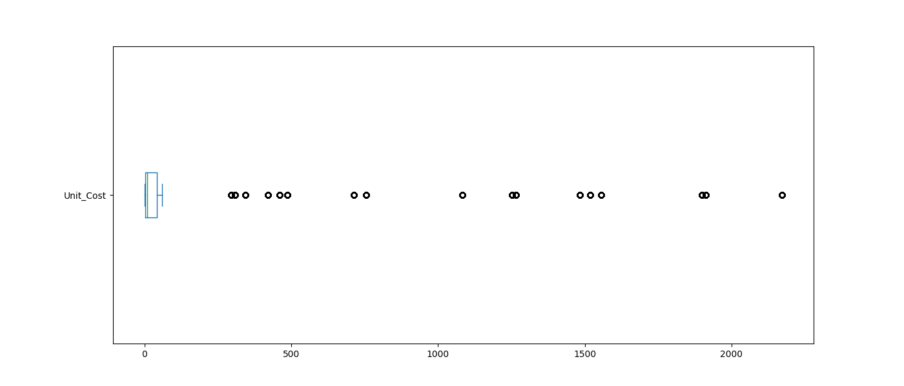

Nous constatons donc que nos études sur les produits, qui tournent autour de 500 dollars, sont considérées comme une valeur aberrante.

```python
sales_dt['Unit_Cost'].plot(kind='density', figsize=(14, 6))
plt.show()
```

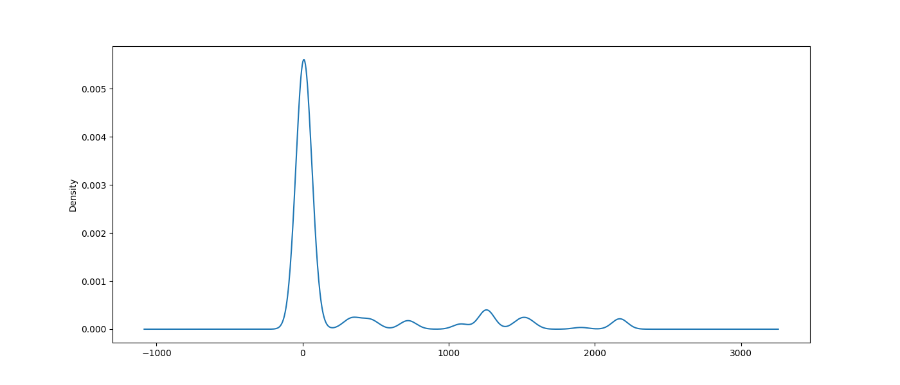

Il en va de même lorsqu'on réalise un diagramme de densité, voici à quoi cela ressemble.

On va dessiner deux autres graphiques dans lesquels nous allons indiquer la moyenne et la médiane, 

```python
ax = sales_dt['Unit_Cost'].plot(kind='density', figsize=(14, 6))
ax.axvline(sales_dt['Unit_Cost'].mean(), color='red')  # la moyenne sera représentée par une ligne rouge.
ax.axvline(sales_dt['Unit_Cost'].median(), color='blue')  # la médiane sera représentée par une ligne bleu.

# On affiche le graphique.
plt.show()
```

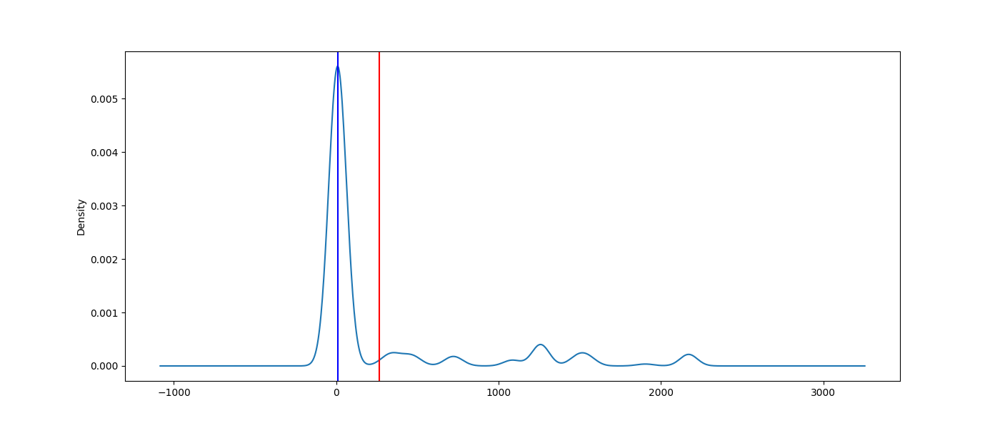

On réalise ensuite un histogramme rapide du coût.

```python
ax = sales_dt['Unit_Cost'].plot(kind='hist', figsize=(14, 6))
ax.set_ylabel("Nombre de ventes")
ax.set_xlabel('montant en dollars')

plt.show()
```

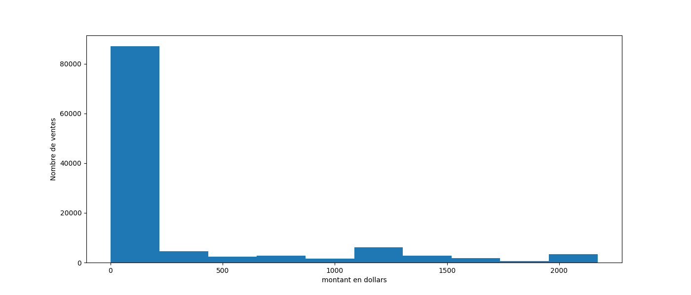


### Analyse catégorielle et visualisation
Cet analyse se fera uniquement sur leur des champs catégoriques. Comme le champ `"Age_Group"`.

```python
# Fonction de calcul des effectifs absoluts pour chaque catégorie.
counts = sales_dt['Age_Group'].value_counts()
print(counts)
```

```
Adults (35-64)          55824
Young Adults (25-34)    38654
Youth (<25)             17828
Seniors (64+)             730
Name: Age_Group, dtype: int64
```

```python
# On affiche un diagramme circulaire des effectifs calculés.
counts.plot(kind='pie', figsize=(6, 6))
plt.show()
```

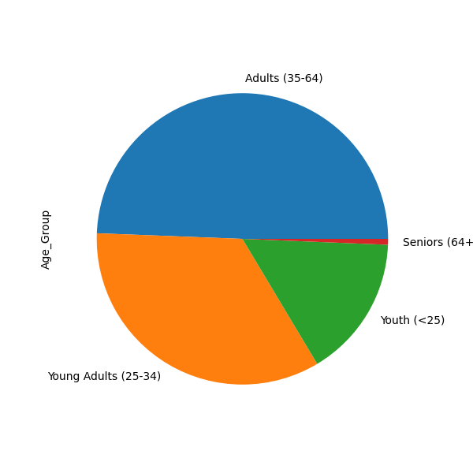

```python
# On affiche le diagramme à bande des effectifs.
ax = counts.plot(kind='bar', figsize=(14, 6))
ax.set_ylabel('Nombre de ventes')
plt.show()
```

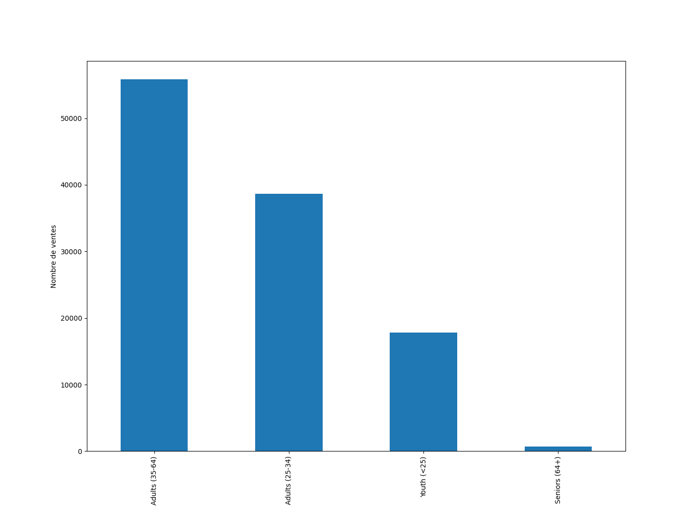


### Relation entre les colonnes

```python
# On étudie la corrélation entre les colonnes.
corr = sales_dt.corr()
print(corr)

```

Ce qui donne le résultat suivant :

```
                     Day      Year  Customer_Age  Order_Quantity  Unit_Cost  Unit_Price    Profit      Cost   Revenue
Day             1.000000 -0.007635     -0.014296       -0.002412   0.003133    0.003207  0.004623  0.003329  0.003853
Year           -0.007635  1.000000      0.040994        0.123169  -0.217575   -0.213673 -0.181525 -0.215604 -0.208673
Customer_Age   -0.014296  0.040994      1.000000        0.026887  -0.021374   -0.020262  0.004319 -0.016013 -0.009326
Order_Quantity -0.002412  0.123169      0.026887        1.000000  -0.515835   -0.515925 -0.238863 -0.340382 -0.312895
Unit_Cost       0.003133 -0.217575     -0.021374       -0.515835   1.000000    0.997894  0.741020  0.829869  0.817865
Unit_Price      0.003207 -0.213673     -0.020262       -0.515925   0.997894    1.000000  0.749870  0.826301  0.818522
Profit          0.004623 -0.181525      0.004319       -0.238863   0.741020    0.749870  1.000000  0.902233  0.956572
Cost            0.003329 -0.215604     -0.016013       -0.340382   0.829869    0.826301  0.902233  1.000000  0.988758
Revenue         0.003853 -0.208673     -0.009326       -0.312895   0.817865    0.818522  0.956572  0.988758  1.000000
```

```python
fig = plt.figure(figsize=(10, 10))
plt.matshow(corr, cmap='RdBu', fignum=fig.number)
plt.xticks(range(len(corr.columns)), corr.columns, rotation='vertical')
plt.yticks(range(len(corr.columns)), corr.columns)

plt.show()
```

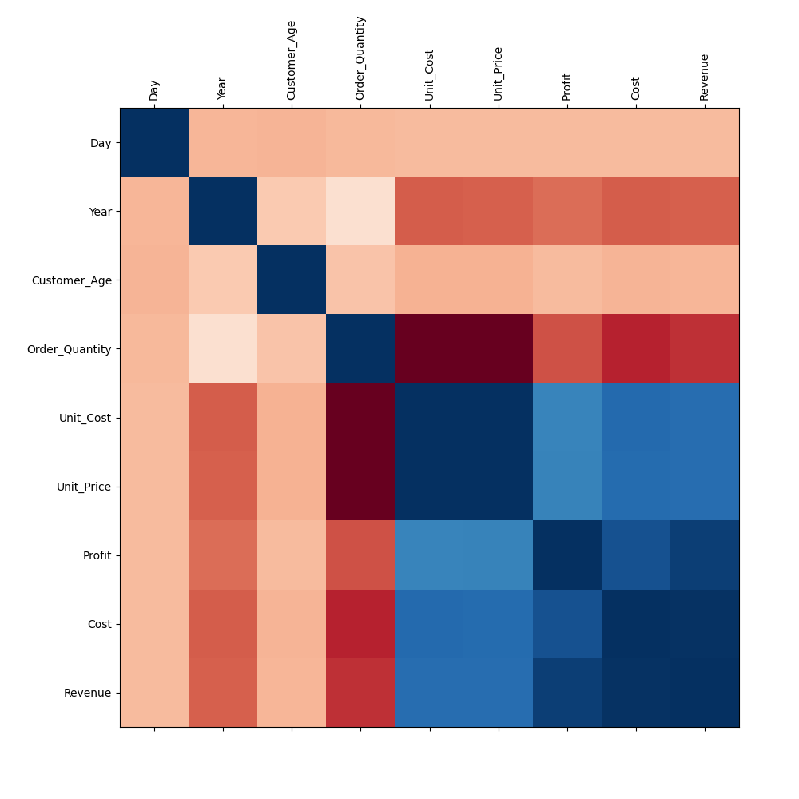


```python
sales_dt.plot(kind='scatter', x='Customer_Age', y='Revenue', figsize=(6, 6))
plt.show()
```

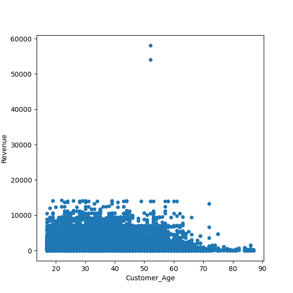


```python
sales_dt.plot(kind='scatter', x='Revenue', y='Profit', figsize=(6, 6))
plt.show()
```

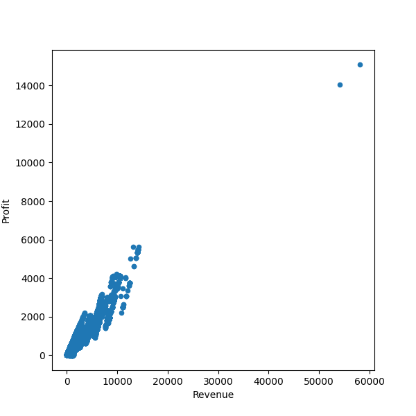

```python
ax = sales_dt[['Profit', 'Age_Group']].boxplot(by='Age_Group', figsize=(10, 6))
ax.set_ylabel('Profit')
plt.show()
```

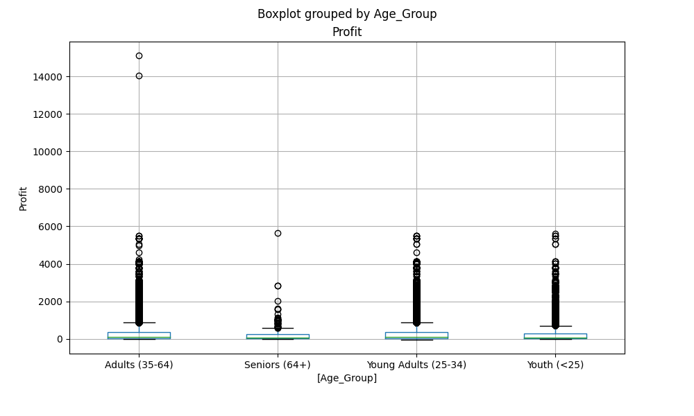


```python
boxplot_cols = ['Year', 'Customer_Age', 'Order_Quantity', 'Unit_Price', 'Profit']
sales_dt[boxplot_cols].plot(kind='box', subplots=True, layout=(2, 3), figsize=(14, 8))

plt.show()
```

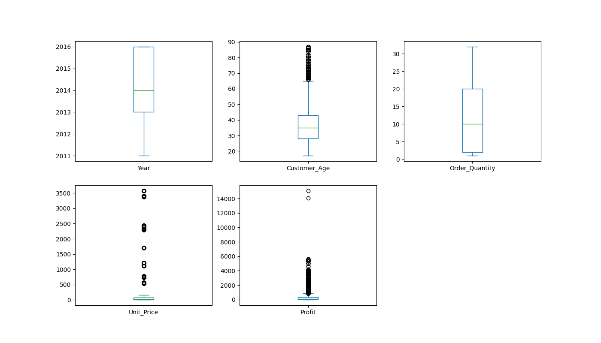


### Lutte des colonnes


