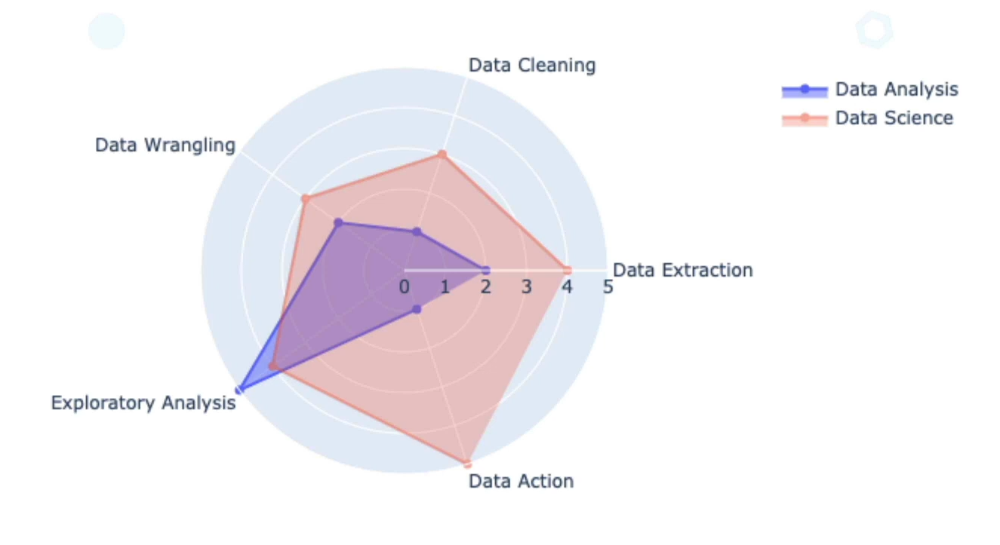

## Généralités

### Définition
Je pense que l'article de Wikipedia le résume parfaitement. L'analyse de données est le processus d'inspection, de nettoyage, de transformation et de modélisation des données dans le but de découvrir des informations utiles, de tirer des conclusions et de soutenir la prise de décision.  

Analysons cette définition pièce par pièce. La première partie du processus d'analyse des données est généralement fastidieuse. Elle commence par la collecte des données, leur nettoyage et leur transformation en vue d'une analyse ultérieure. C'est ici que Python et les outils de données PI Excel entrent en jeu. Nous allons utiliser `pandas` pour lire, nettoyer et transformer nos données. 

La modélisation des données consiste à adapter des scénarios de la vie réelle aux systèmes d'information en utilisant des statistiques inférentielles pour voir si un modèle ou un schéma se dessine. Pour cela, nous allons utiliser les fonctionnalités d'analyse statistique panéliste et les visualisations pour matplotlib et Seabourn.

> Un **panéliste** est une personne, ou un ménage, ou une entreprise membre d'un panel, et qui en tant que membre de ce panel, a pour rôle de communiquer régulièrement des données afin de rendre exploitable les études faisant l'objet du panel associé. 
> Ici, il s'agit d'utiliser les fonctionnalités d'analyse statistique qui vont nous permettre d'explorer
> les données afin de mieux les exploiter.

Une fois que nous aurons traité les données et créé des modèles à partir de celles-ci, nous essaierons d'en tirer des conclusions en trouvant des anomalies qui pourraient apparaître. 

Le mot *information* est ici essentiel. Si nous essayons de transformer des données en informations, nos données pourraient être par exemple une énorme **liste de tous les achats effectués à Walmart au cours de l'année dernière**, alors l'information sera quelque chose comme les **pop tarts qui se vendent mieux le mardi**.

> **Pop tarts** est le goûter préféré des américains : 2 couches de pâte sablée qui entourent un merveilleux fourrage. Ce dernier pouvant être à la framboise, à la myrtille, au beurre de cacahuètes... A manger tel quel ou à passer au grille pain.

C'est donc l'objectif final de l'analyse des données, nous devons fournir des preuves de nos conclusions, créer des rapports et des tableaux de bord lisibles afin d'aider les autres personnes ou départements avec les informations que nous avons recueillies. 

De multiples acteurs utiliseront tes résultats d'analyse : marketing, ventes, cadres comptables, etc.
Ils peuvent tous avoir besoin de rapports différents ou d'un niveau de détail différent et/ou avoir besoin d'une vision différente de la même information. Bref, des outils sont disponibles aujourd'hui pour l'analyse des données.

### Outils d'analyse de données
Les outils d'analyse de données sont répartis en deux grandes catégories. A savoir:
- **Les outils d'autogestion** sont des produits proches des outils que tu peux acheter et commencer à utiliser dès la sortie de la boîte. Par exemple: *Excel*. *Tableau* et *Luchar* sont probablement les plus populaires pour l'analyse des données.
- À l'autre extrême, nous avons ce que nous appelons des **langages de programmation** que nous pouvons  appeler outils ouverts et libre d'accès. Ils ne sont pas vendus par un fournisseur individuel, mais sont constitués de bibliothèques open source. **Python**, **R** et **Julia** sont les plus populaires dans cette catégorie. 

#### Les outils d'autogestion
Le principal avantage des outils fermés comme Tableau ou Excel est qu'ils sont généralement faciles à apprendre et à utiliser. L'entreprise propriétaire fournit une bonne documentation de son produit. Le plus gros désavantage est que la portée des fonctionnalités de ces outils est limitée. On ne peut donc pas
aller au delà.

#### Les langage de programmation
En revanche, l'utilisation de Python et de l'univers des outils PyData nous offre d'énormes avantages et une flexibilité étonnante. Si par exemple tu as besoin de récupérer des données à partir d'une API fermée en utilisant une clé secrète d'authentification, tu peux le faire. Si tu as besoin de consommer (récupérer) des données directement à partir des Kinesis de *Amazon Web Service (AWS)*, ça aussi tu peux.
Les langages de programmation sont les outils les plus puissants que tu peux apprendre. Un autre avantage important est la portée générale d'un langage de programmation. Il s'agit des autres
point fort, à savoir: la POO, programmation système, gestion des fichiers en lecture/écriture, gestion des bases de données, etc.  

Le principal inconvénient d'un langage de programmation est qu'il n'est pas aussi simple à apprendre comme un outil d'autogestion avec de belles interfaces graphiques. Tu dois d'abord apprendre les bases de l'algorithmie, ensuite les bases de la programmation dans le langage choisi, et cela prend énormement du temps.

### Pourquoi choisir Python ?
Python est le meilleur langage de programmation. Il est simple, intuitif, et lisible, il comprend des milliers de bibliothèques pour faire pratiquement tout, de la cryptographie à l'IoT. Python est libre, gratuit et open source. Cela signifie qu'il y a des milliers d'interventions de personnes très expérimentés qui examinent les fonctions internes du langage et des bibliothèques implémentées.
De *Google* à la Banque d'Amérique, en passant par *Wall Street*, *Pentagon*, etc, ces grandes institutions font confiance à Python tous les jours. C'est à dire qu'il sera très difficile de s'en débarrasser un jour. Enfin, Python bénéficie d'un excellent esprit d'open source, il y a une incroyable communauté autour, et les documentations sont plutôt exhaustives.

### Quand choisir R ?
Je ne peux pas parler d'analyse de données sans parler du langage **R**. Ce dernier est également un excellent langage de programmation. R dispose d'une énorme bibliothèque de fonctions statistiques. Et si tu te retrouve un jour à faire de l'analyse dans un domaine hautement technique, qui requiert une études statistiques avancées par exemple, alors là, tu seras obligé d'y jeter un coup d'œil !

### Processus d'analyse de données
1. Le processus commence par l'obtention des données : d'où viennent les données ? Elles peuvent généralement provenir d'une base de données, mais aussi depuis des fichiers stockés dans un format différent ou depuis des APIs Web. 

2. Une fois que tu a collecté les données, tu dois les nettoyer. Si la source des données est ta propre base de données, alors elle est probablement en forme d'écriture. Si tu utilise des sources plus extrêmes comme le web scraping, le processus de nettoyage sera plus fastidieux. 

3. Une fois les données nettoyées, tu dois maintenant les réorganiser et les remodeler pour une meilleure analyse, en transformant les champs, en fusionnant les données si elles proviennent de plusieurs sources, etc. L'objectif de cette étape est de préparer les données pour l'étape suivante.  

4. L'étape d'analyse consiste à extraire des modèles à partir des données qui sont maintenant propres à toute forme de capture de tendances ou d'anomalies. C'est dans cette étape que l'analyse statistique sera fondamentale.  

5. Enfin, il est temps de faire quelque chose avec l'analyse faite sur les données. S'il s'agissait d'un projet de science des données (Data Science), nous pourrions être prêts à mettre en œuvre des **modèles d'apprentissage automatique (Machine Learning)**. Si nous nous concentrons uniquement sur l'analyse des données, nous aurons probablement besoin de construire des rapports pour communiquer nos résultats d'analyse afin de soutenir la prise de décision. 

| Numéro | Étape                     | Tâches possibles                                          |
|--------|---------------------------|-----------------------------------------------------------|
|   01   | Récupération de données   | SQL, Data scrapping, Lecture de fichiers (CSV, JSON, XML), Consulter des APIs, Achat de données, etc.|
|   02   | Nettoyage des données     | Donnée manquant et données vides, Types de données incorrects, Valeurs incorrectes ou invalides, Données aberrantes et non pertinentes, etc. |
|   03   | Préparation des données   | Données hiérarchisées, Manipulation de données, Redimentionnement et transformation, Indexation des données pour un accès rapide, Fusion des données issus de différentes sources, etc. |
|   04   | Analyse des données       | Exploration, Construction des modèles statistiques, Visualisation et représentation, Analyse de corrélation et de causalité, Test d'hypothèse, Analyse statistique, etc.|
|   05   | Exploitation              | Machine learning, Feature Engineering, Prise de décision, Tableau de bord et rapports en temps réel, etc. |

> - En statistique, **une donnée aberrante** (**outlier** en anglais) est une valeur ou une observation qui est **distante** des autres observations effectuées sur le phénomène étudié. C'est-à-dire qu'elle s'oppose grandement au autres valeurs « normalement » mesurées.
> - Expliquer d'une **corrélation**: tout simplement, lorsque deux variables présentent une corrélation, on peut l'expliquer simplement en présentant le fait qu'il existe une relation entre les deux variables en question. Si par exemple, les variables bougent dans une direction opposée, la corrélation est dite "négative". À l'inverse, si les variables bougent dans la même direction, la corrélation est dite "positive".
> - Différence entre **corrélation** et **causalité**: La corrélation correspond à un lien statique entre deux variables. Les conséquences et les effets du lien ne sont pas questionnés. A l'inverse, la causalité est un lien qui permet d'affirmer qu'une variable agit sur l'autre, et dans quelle mesure. La causalité prend donc en considération les conséquences du lien tandis que la corrélation correspond au lien statique. C'est pour cela on parle souvent de constante de corrélation.
> - Le **feature engineering** ou ingénierie des fonctionnalités est une étape préliminaire du *machine learning* visant à réaliser un prétraitement des données brutes avant leur utilisation comme données d'apprentissage. Par exemple: la tokenisation en NLP, le changement d'echelle, etc.

Enfin bref, dans la vie réelle, ce processus n'est pas si linéaire (ligne droite), nous sautons souvent d'une étape à l'autre et cela ressemble plus à un cycle qu'à une ligne droite.

### Analyse de données VS Science de données
> Quelle est la différence entre *Data analysis* et *Data science* ?

Il n'y a pas tellement de grandes différences entre analyse de données et science de données. Les principales différences sont que les data scientists (Scientifique de données) ont plus de compétence en programmation et en mathématique qu'ils peuvent appliquer en machine learning et au procédés ETL.

> **Procédés ETL (Extract Transform Load)**: *encore un mot à la mode que les gens utilisent pour paraître plus intelligent*. Pour le définir simplement, ce sont des processus par lesquels une personne extrait, transforme et charge des données vers des destinations respectives.

Les analystes, quant à eux, ont de meilleures compétences en matière de communication, création de meilleurs rapports avec des capacités de narration plus élevées. Au fait, le *graphe de Weiler* que tu as ci-dessous résume tous.

Et oui ! T'as tout compris ! Nous somme que des *explorateurs*.

### Écosystème Python et PyData
Les bibliothèques les plus importantes que nous utiliserons sont pandas pour l'analyse des données, et matplotlib, Seabourn pour les visualisations. Mais l'écosystème PyData est vaste et il existe de nombreuses bibliothèques utiles pour des cas d'utilisation spécifiques. Voici toute la liste des PyData:

- [pandas](https://pandas.pydata.org/): La pierre angulaire de notre travail d'analyse de données avec Python.
- [matplotlib](https://matplotlib.org/stable/index.html): La bibliothèque de base pour les visualisations. Les autres bibliothèques que nous utiliserons sont construites au-dessus de matplotlib.
- [numpy](https://numpy.org/): La bibliothèque numérique qui sert de base à tous les calculs en Python.
- [seaborn](https://seaborn.pydata.org/): Un outil de visualisation statistique construit sur matplotlib.
- [statsmodels](https://www.statsmodels.org/stable/index.html): Une bibliothèque avec de nombreuses fonctions statistiques avancées. Oui, je sais ce que je dis !
- [scipy](https://docs.scipy.org/doc/): Calcul scientifique avancé, comprenant des fonctions d'optimisation, d'algèbre linéaire, de traitement d'images et bien plus encore.
- [scikit-learn](https://scikit-learn.org/stable/): La bibliothèque d'apprentissage automatique (Machine Learning) la plus populaire pour Python. Elle contient tous les algorithmes de machine learning les plus utilisés, tout, sauf les algorithmes de Deep Learning.

 
 

<!-- - Je passe à la session **suivante**: [Algorithmes d'apprentissage fondamentaux](../core_learning_algorithms/README.md) -->
[<--](../README.md) Je reviens à la session **précédente**: [Data analysis](../README.md)
